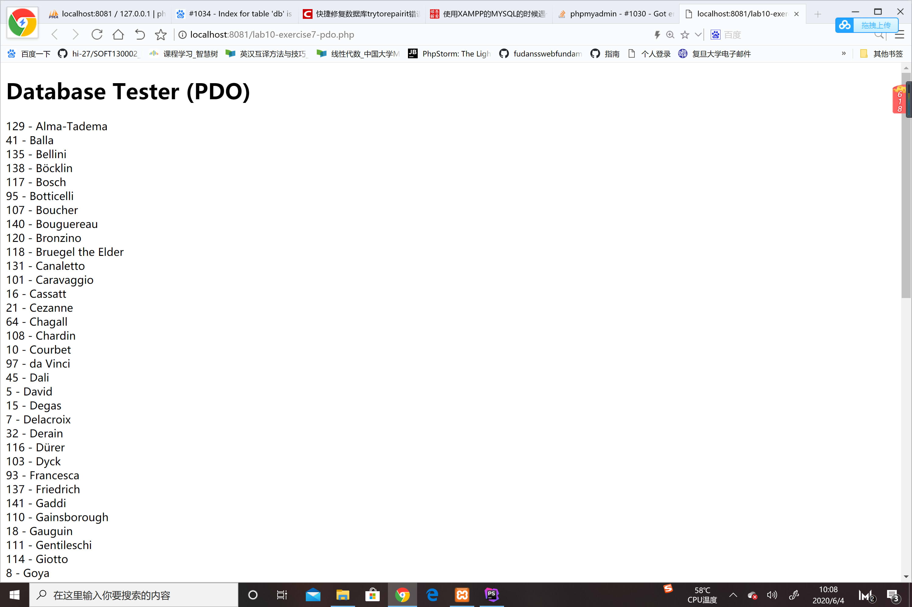
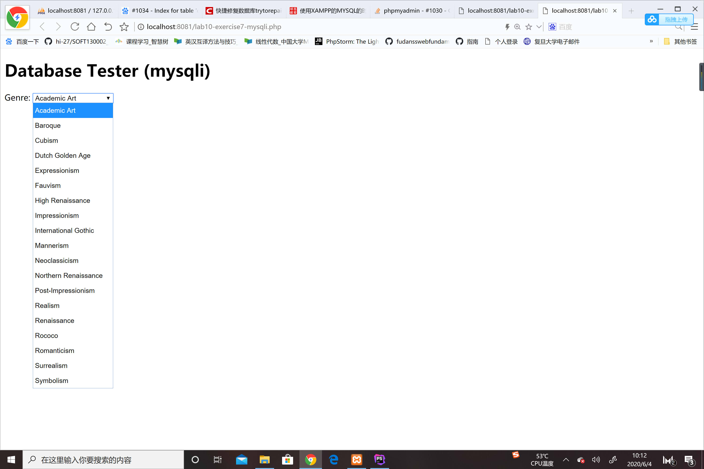
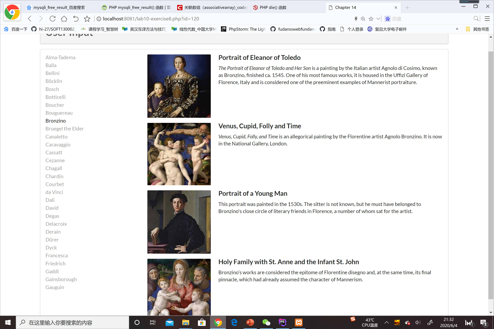

#### exercise7
截图1：
 
首先创建了一个pdo对象，并提供了数据库名称，用户名和密码。 
$pdo->setAttribute(PDO::ATTR_ERRMODE, PDO::ERRMODE_EXCEPTION)设置了遇到错误的处理方式，他会抛出一个异常，然后catch
语句会抓住它，然后提供错误信息并退出脚本 
$sql = "select * from Artists order by LastName"表示把artists表格中所有的数据按照他们lastname排序。
 $result = $pdo->query($sql)将获得的结果放入result变量中 
 while ($row = $result->fetch()) {
         echo $row['ArtistID'] . " - " . $row['LastName'] . " ";
     }将result中的记录一条一条用fetch()取出，再通过echo将记录中的id与lastname输出。 
截图2：
 
如果访问数据库出现错误就结束脚本，如果没有错误继续执行脚本。 
$result = mysqli_query($connection, $sql)按照sql中的语句查询数据库，将结果存入result。 
$row = mysqli_fetch_assoc($result)取出记录形成关联数组存入row。用echo写成option元素的形式，使最终
结果以下拉列表形式呈现。 
最后清空result内存，结束访问数据库。
#### exercise8
截图3：
 
##### outputArtists()
前面部分用练习7中第一种方式获得了艺术家的lastname并且取排序前30个列出来。并通过echo将这30个lastname
放入超链接的标签中，将href设为页面自己，id设为对应艺术家的id，class全部设为item，当被点击后加一条
active。 
##### outputPaintings() 
判断被获取的数值如果存在且大于0，那么用同样的方式从paintings中找出相对应id的画，把结果集一条一条塞入
row中，在调用第三个函数，将画作显示出来。 
##### outputSinglePainting($row)
传入第二个函数中的row变量，将row记录中的值比如file name、title写入相应的HTML元素中，由此将其展示出来。 
#### exercise9
共有三种执行sql语句的方法。用$sql表示需要执行的sql语句。 
##### exec()
返回的是受到影响的语句，即删除、修改和新增的语句数量。对于select语句返回值永远是0。 
##### query()
返回的获得的结果集，如果没有匹配的结果，返回false。 
##### prepare() and execute()
prepare是预执行，execute即执行。 
预执行的优点： 
预处理语句大大减少了分析时间，只做了一次查询（虽然语句多次执行）。 
绑定参数减少了服务器带宽，你只需要发送查询的参数，而不是整个语句。 
预处理语句针对SQL注入是非常有用的，因为参数值发送后使用不同的协议，保证了数据的合法性。