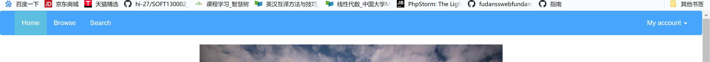
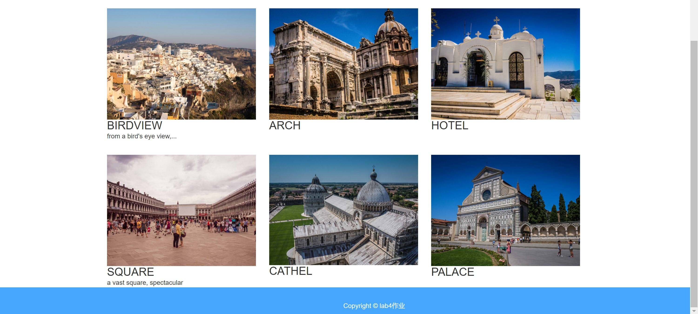

###设计文档
####导航栏
    使用navbar-inverse，用css将其颜色调成蓝色。
    my account的下拉菜单用glyphicon在每个选项前加上了图标。
   
####轮播图片
    使用carousel-indicators和-inner，用css改变了它的宽度和margin-left使它居中，并且在箭头两侧没有留白。
   
####热图展示
    使用grid做了两行共六张图片的展示，在每一个中加入h3与普通的div作为图片的标题和介绍。
    图片的标题使用uppercase使它大写。
####页脚
    使用copyright，用css调成蓝色和nav一样。
   
