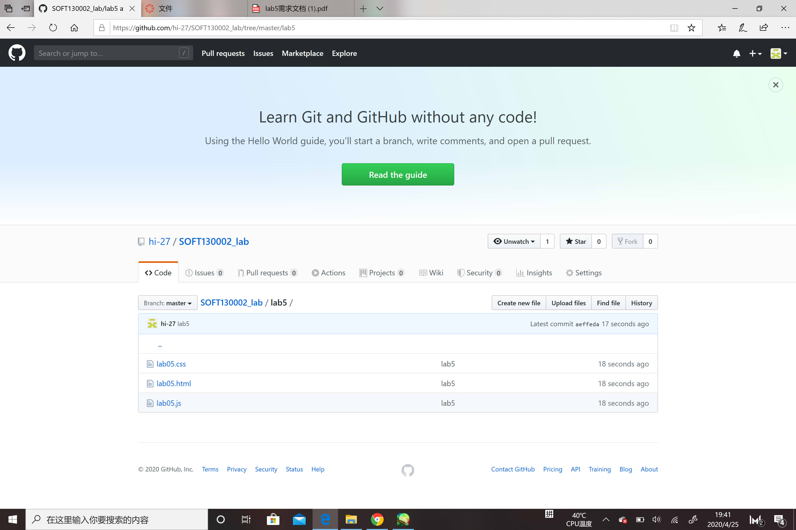

### 设计文档
#### 第一部分
获取url的value；使用RegExp进行匹配；在url_result中填入参数值。 
RegExp的正则匹配，尝试了很多种，但是总还是有等号留着，后来用substr把等号去掉了。
#### 第二部分
在mouse over时在mul中填入初始值1，新建date，使用getSecond获取当前时间的秒数。根据大小判断使用哪一种方案。 
if else语句分别使用setInterval来完成梅5妙进行value值的翻倍。 
完成之后clearInterval停下value翻倍。
#### 第三部分
获取输入的字符串，用split将字符串拆开。在找到0号位置的字母，与后面的字母比对，count计数。 
完成之后，将字符串中第一个字母全部去掉，形成新的字符串。 
重复以上行为，直到字符串为空。 
将每一个字母和它的count分别计入数组。 
找出数组中数字最大的和它的index，到字符数组中找出字母。 
填入result的value。 
提交截图： 

网页效果截图： 

