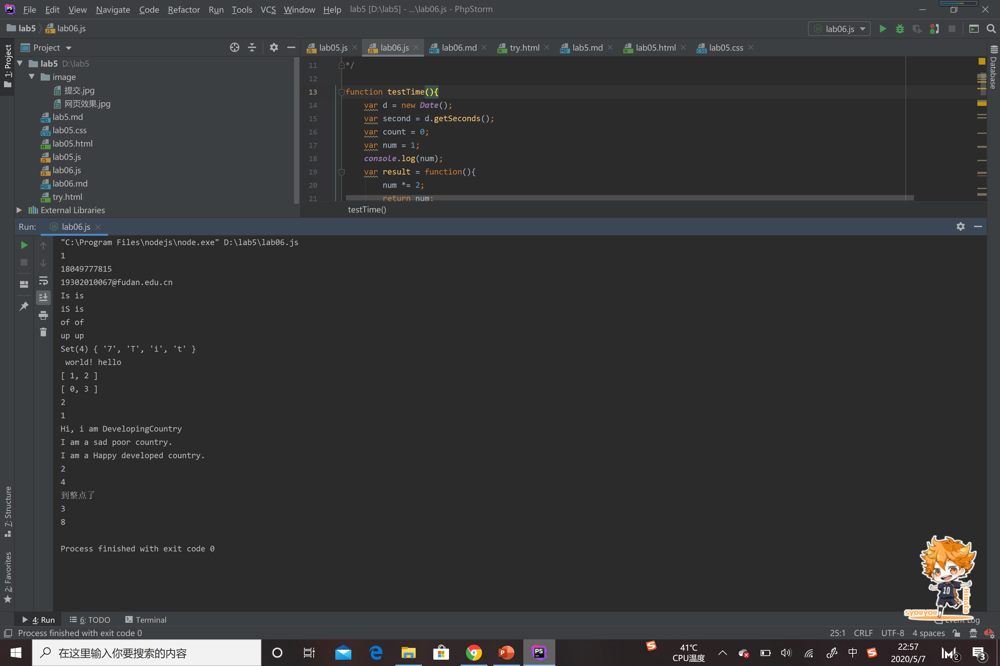

#### 第二题
/^1[34578][0-9]{9}$/：^1表示以1开头；[34578]表示第二位匹配其中任意一个数字；[0-9]{9}表示后九位数字随机产生。 
/^[a-z0-9A-Z]+[a-z0-9A-Z_]{3,15}@([a-z0-9A-Z]+\.)+[a-zA-Z]{2,4}$/；^[a-z0-9A-Z]首字母不能是下划线；[a-z0-9A-Z_]{3,15}:
用户名一般是4~16位，可以是大小写字母数字和下划线；([a-z0-9A-Z]+\.)+[a-zA-Z]{2,4}域名和顶级域名。 
#### 第三题
/\b([a-z]+) \1\b/ig：\b([a-z]+)表示从一个单词开始匹配若干个字母；\1\b中\1选中刚刚匹配的单词作为这个单词的匹配表达式；
结尾处ig分别表示不管大小写和尽可能多的匹配结果。
#### 继承
借用构造函数 
在构造子类的时候,要先使用call调用父类，这样就直接拥有了父类里的属性，但是借不到实例函数，就要重新写。
而且因为只用了构造函数，所以原型里的函数也无法获得。 
原型链 
把子类的原型直接设为父类的原型，于是和上面的情况相反，得到了实力函数、原型里的函数还有属性，但是没有了
往父类的构造函数里传递参数的机会。 
object.create() 
其中第一个参数感觉和原型链一样，都是把子类的原型直接设为父类的原型，然后第二个参数就可以增加修改子类的
属性和值。 
#### 区别，使用
array的方法比较多，只能用位置来访问内容。可以用sort排序，slice获取子数组等。 
set比较像数学里的集合，元素具有唯一性，add一样的内容，是无效的。只能通过get(key)来访问内容。 
map就是类似对象，具有属性和值以一对应的特点。 
 
运行截图： 

